# Detailed Analysis: Why Some Values Don't Change

## What IS Calculating & Changing ✅

### 1. Market Block (ALWAYS CHANGES)
```
- spot_price: ✅ Updates from live intraday data
- spot_change: ✅ Recalculates vs previous close
- vix: ✅ Updates from market data
- regime: ✅ Recalculates based on current data
```

### 2. Direction Engine (CHANGES)
```
- Tomorrow/3-Days/Week predictions: ✅ Changes
  Reason: Uses trained BiLSTM model on fresh features
  
- Risk Score: ✅ Changes
  Reason: Recalculates based on current market
```

### 3. Seller Engine - Calculated Values (CHANGES)
```
- safe_range: ✅ Changes
  Formula: spot ± (volatility × multiplier × sqrt(days))
  Depends on: Current spot price, current volatility
  
- max_pain: ✅ Changes
  Reason: Recalculates from current features
```

### 4. Buyer Engine (CHANGES)
```
- breakout_today: ✅ Changes
  Reason: Uses trained model on fresh intraday features
  
- spike_direction_bias: ✅ Changes
  Reason: Recalculates from current momentum
```

---

## What is NOT Changing (Or Uses Heuristics) ❌

### 1. Volatility Trap Risk (SAME VALUE: 0.95)

**Current Code in seller/model.py:**
```python
def compute_vol_trap_risk(features_df, model=None) -> dict:
    if model is None:
        # ❌ FALLBACK HEURISTIC (model not found)
        trap_raw = iv_pct - rv_pct
        score = np.clip(trap_raw / 2 + 0.5, 0, 1)
        label = "LOW" if score < 0.33 else "MEDIUM" if score < 0.67 else "HIGH"
        return {"score": float(score), "label": label, ...}
```

**Why it stays at 0.95:**
- Model file `seller_trap.pkl` likely NOT being loaded
- Falls back to heuristic calculation
- If IV percentile and RV percentile don't change much, result is same
- Heuristic: `score = (IV_pct - RV_pct) / 2 + 0.5`
- If ratio stays constant → Score stays 0.95

**What should happen:**
- ✅ Should load `seller_trap.pkl` model
- ✅ Should use model prediction instead of heuristic
- ✅ Score would change with different market conditions

---

### 2. Expiry Stress (SAME VALUE: 0.15)

**Current Code in seller/model.py:**
```python
def compute_expiry_stress(features_df, model=None) -> dict:
    if model is None:
        # ❌ FALLBACK HEURISTIC
        vol = features_df["vol_20d"].iloc[-1] if "vol_20d" in features_df.columns else 0.01
        trap_score = compute_vol_trap_risk(features_df)["score"]
        normalized_vol = min(1.0, vol / 0.03)
        stress = 0.6 * trap_score + 0.4 * normalized_vol
        stress = np.clip(stress, 0, 1)
        return {"score": float(stress), "label": label}
```

**Why it stays at 0.15:**
- Model file `seller_regime.pkl` likely NOT being loaded
- Falls back to heuristic: `0.6 × trap_score + 0.4 × normalized_vol`
- If trap_score is 0.95 and vol is constant:
  - `stress = 0.6 × 0.95 + 0.4 × (vol/0.03)`
  - If vol is ~0.01 (1%): `stress = 0.57 + 0.13 = 0.70`... doesn't match 0.15
  
**So either:**
1. Vol is very low, or
2. Trap score is different, or
3. Something else is overriding

**What should happen:**
- ✅ Should load `seller_regime.pkl` model
- ✅ Model should output regime probability
- ✅ Stress would be: `0 × p_low + 0.5 × p_med + 1.0 × p_high`

---

### 3. Historical Hit Rate (ALWAYS 72%)

**Current Code in infer.py line 167:**
```python
historical_hit_rate = 0.72  # ❌ HARD-CODED!
```

**Why it never changes:**
- It's literally hard-coded as a constant!
- Never calls any calculation function
- Just assigns 0.72 directly

**What should happen:**
- ✅ Should calculate from historical backtest results
- ✅ Should vary based on current market regime
- ✅ Should be data-driven, not hard-coded

---

### 4. Historical Spike Rate (ALWAYS 58%)

**Current Code in infer.py (Buyer block):**
```python
historical_spike_rate = 0.58  # ❌ HARD-CODED!
```

**Same issue:** Hard-coded, never changes.

---

## The Problem Summary

```
┌─────────────────────────────────────────────────────────────┐
│  WHAT'S HAPPENING vs WHAT SHOULD HAPPEN                    │
├─────────────────────────────────────────────────────────────┤
│                                                             │
│ 🔴 ROOT CAUSE FOUND:                                        │
│ Models fail to load: "No module named 'numpy._core'"       │
│                                                             │
│ Volatility Trap: 0.95                                       │
│   Current: Heuristic fallback (model FAILS to load)        │
│   Should: Use seller_trap.pkl model prediction             │
│   Problem: numpy version mismatch - joblib can't unpickle  │
│                                                             │
│ Expiry Stress: 0.15                                         │
│   Current: Heuristic calculation (model FAILS to load)     │
│   Should: Use seller_regime.pkl model prediction           │
│   Problem: numpy version mismatch - joblib can't unpickle  │
│                                                             │
│ Historical Hit Rate: 72%                                    │
│   Current: Hard-coded constant                             │
│   Should: Calculated from backtest results                 │
│   Problem: Never implemented as calculation                │
│                                                             │
│ Historical Spike Rate: 58%                                  │
│   Current: Hard-coded constant                             │
│   Should: Calculated from historical data                  │
│   Problem: Never implemented as calculation                │
│                                                             │
└─────────────────────────────────────────────────────────────┘
```

## 🔴 CRITICAL ISSUE: Model Loading Failure

### Error Details
```
Error loading seller models: No module named 'numpy._core'
Trap model: False
Regime model: False  
Breach model: False
```

### Root Cause
The model files (`seller_trap.pkl`, `seller_regime.pkl`, `seller_breach.pkl`) were pickled with a **different version of numpy** than what's currently installed.

**Timeline:**
- Models trained with: numpy 1.x (using old API)
- Currently running: numpy 2.x (uses new `numpy._core` module)
- joblib tries to unpickle → fails → returns None → falls back to heuristics

### Why This Causes Static Values

When `load_models()` returns `(None, None, None)`:

```python
def build_seller_block(...):
    trap_model, regime_model, breach_model = models  # All None!
    
    # In compute_vol_trap_risk:
    if model is None:  # ← TRUE, model is None
        # Uses heuristic fallback
        trap_raw = iv_pct - rv_pct
        score = np.clip(trap_raw / 2 + 0.5, 0, 1)  # ← Returns same score
    
    # In compute_expiry_stress:
    if model is None:  # ← TRUE, model is None  
        # Uses heuristic fallback
        stress = 0.6 * trap_score + 0.4 * normalized_vol
```

**Result:** Both use fallback heuristics that compute similar values each time!

---

## Data Flow Diagram: What's Being Calculated

```mermaid
graph LR
    subgraph Input["🔵 INPUT: Market Data (ALWAYS FRESH)"]
        A1["Daily NIFTY Close"]
        A2["Daily VIX Close"]
        A3["Intraday 1-min bars"]
        A4["Live spot price"]
    end
    
    subgraph Features["🟡 FEATURES: Build from Input"]
        B1["Calculate Returns"]
        B2["Calculate Volatility"]
        B3["Calculate Momentum"]
        B4["Calculate Technicals"]
    end
    
    subgraph Models["🟢 MODELS: Load & Predict"]
        C1["Direction BiLSTM<br/>✅ Works"]
        C2["Seller Trap<br/>⚠️ Fallback"]
        C3["Seller Regime<br/>⚠️ Fallback"]
        C4["Buyer Models<br/>✅ Works"]
    end
    
    subgraph Output["🔴 OUTPUT: JSON Results"]
        D1["Spot Price ✅"]
        D2["Direction ✅"]
        D3["Trap ⚠️"]
        D4["Stress ⚠️"]
        D5["Hit Rate ❌"]
    end
    
    A1 --> B1
    A2 --> B2
    A3 --> B3
    A4 --> B4
    
    B1 --> C1
    B2 --> C2
    B3 --> C4
    B4 --> C3
    
    C1 --> D2
    C2 --> D3
    C3 --> D4
    C4 --> D1
    
    D5 -.-> Output
    
    style C2 fill:#FFA500
    style C3 fill:#FFA500
    style D5 fill:#FF6B6B
```



---

## Why Models Might Be Using Fallback

The `load_models()` function in seller/model.py:

```python
def load_models():
    try:
        trap_model = joblib.load(MODEL_DIR / "seller_trap.pkl")
        regime_model = joblib.load(MODEL_DIR / "seller_regime.pkl")
        breach_model = joblib.load(MODEL_DIR / "seller_breach.pkl")
        return trap_model, regime_model, breach_model
    except Exception as e:
        logger.error(f"Error loading seller models: {e}")
        return None, None, None  # ← Returns None if files missing!
```

**Then in infer.py:**
```python
sel_models = seller.model.load_models()  # Gets (None, None, None)

# Later:
seller_block = build_seller_block(sel_feats, nifty, sel_models)

# Inside build_seller_block:
trap_model, regime_model, breach_model = models  # All None!
trap = compute_vol_trap_risk(sel_feats, trap_model)  # trap_model=None → uses fallback!
```

---

## How to Fix This

### ✅ FIX #1: Retrain Models with Current numpy Version (RECOMMENDED)

The models need to be retrained with the current environment to fix numpy compatibility:

```bash
# 1. Go to engine directory
cd aegismatrix-engine

# 2. Retrain all models (this will use current numpy version)
python train_all.py

# 3. Verify models loaded successfully
python -c "from seller.model import load_models; t,r,b = load_models(); print(f'Trap: {t is not None}, Regime: {r is not None}, Breach: {b is not None}')"
# Should print: Trap: True, Regime: True, Breach: True

# 4. Run inference to verify calculations update
python infer.py
```

**Why this works:**
- New models will be pickled with numpy 2.x API
- joblib will successfully unpickle them
- Calculations will use actual ML models instead of fallback heuristics
- Volatility Trap and Expiry Stress will show real predicted values

### Alternative Option 2: Install Compatible numpy (If retrain fails)

If retraining fails, downgrade numpy to 1.x:

```bash
# 1. Check current numpy version
pip show numpy

# 2. Downgrade to numpy 1.26.x (compatible with old pickled models)
pip install "numpy<2.0"

# 3. Verify models load
python -c "from seller.model import load_models; t,r,b = load_models(); print(f'Models loaded: {t is not None}')"

# 4. Run inference
python infer.py
```

**Note:** This approach is less recommended because numpy 2.x is the future.

### Option 2: Calculate Real Historical Rates (Instead of Hard-Coding)

**In infer.py, replace:**
```python
historical_hit_rate = 0.72  # ❌ HARD-CODED
```

**With:**
```python
# Calculate from actual market conditions
def calculate_historical_hit_rate(nifty_df):
    """Calculate actual historical hit rate from data."""
    if len(nifty_df) < 30:
        return 0.72  # Default if not enough data
    
    # Example: Calculate what % of times safe range was hit
    recent_ranges = nifty_df.tail(30)
    # Simple heuristic: if market moved >1%, range was breached
    breaches = (recent_ranges['High'] - recent_ranges['Low']) / recent_ranges['Close'] > 0.01
    hit_rate = breaches.sum() / len(recent_ranges)
    return float(hit_rate)

# Then use it:
historical_hit_rate = calculate_historical_hit_rate(nifty)
```

### Option 3: Add Logging to Verify Calculations Are Happening

**In seller/model.py, add:**
```python
logger.info(f"Computing vol trap risk - using {'MODEL' if model else 'HEURISTIC'}")
logger.info(f"IV percentile: {iv_pct:.2f}, RV percentile: {rv_pct:.2f}")
logger.info(f"Calculated trap score: {score:.4f}")
```

---

## Verification: Check Your Models

```bash
# 1. List model directory
ls -lh aegismatrix-engine/models/

# 2. Check file sizes
# - seller_trap.pkl should be > 50KB
# - seller_regime.pkl should be > 50KB
# - direction_seq.pt should be > 500KB

# 3. Check timestamps
# - Should be recent (from last training run)
```

If files are missing or old:
```bash
# Retrain models
cd aegismatrix-engine
python train_all.py
```

---

## Summary Table

| Metric | Current | Issue | Fix |
|--------|---------|-------|-----|
| Spot Price | ✅ Changes | None | None |
| Direction | ✅ Changes | None | None |
| Safe Range | ✅ Changes | None | None |
| Max Pain | ✅ Changes | None | None |
| **Volatility Trap** | ❌ Same 0.95 | **Model fails to load (numpy mismatch)** | **Retrain models or downgrade numpy** |
| **Expiry Stress** | ❌ Same 0.15 | **Model fails to load (numpy mismatch)** | **Retrain models or downgrade numpy** |
| **Historical Hit Rate** | ❌ Always 72% | Hard-coded constant | Implement calculation |
| **Historical Spike Rate** | ❌ Always 58% | Hard-coded constant | Implement calculation |
| Buyer Predictions | ✅ Changes | None | None |
| Breach Probabilities | ✅ Changes | Model may fail to load | Retrain (same fix as above) |

---

## Bottom Line

**Your system IS doing calculations!** ✅ But models are **failing to load** due to numpy version mismatch.

### Why Some Values Don't Change

The reason some values don't change is because:

1. **Models fail to unpickle** (numpy 1.x → 2.x incompatibility)
2. **Falls back to simpler heuristics** instead of ML predictions
3. **Hard-coded constants** never implemented as calculations

### What IS Changing ✅

- Spot price (live market data)
- Direction predictions (models load successfully)
- Safe ranges (calculated from volatility)
- Buyer signals (models load successfully)

### What ISN'T Changing ❌

- Volatility Trap (0.95) - heuristic fallback due to model load failure
- Expiry Stress (0.15) - heuristic fallback due to model load failure
- Historical Hit Rate (72%) - hard-coded constant
- Historical Spike Rate (58%) - hard-coded constant

### Immediate Action Required

1. **Retrain models** - This is the main fix
   ```bash
   cd aegismatrix-engine
   python train_all.py
   ```

2. **Verify fix worked**
   ```bash
   python infer.py
   # Check aegismatrix.json - trap and expiry_stress should now show ML predictions
   ```

3. **Optional: Calculate historical rates** (instead of hard-coding)
   - Implement `calculate_historical_hit_rate()` function
   - Implement `calculate_historical_spike_rate()` function
   - These should vary based on market data, not be constants
