# AegisMatrix Data Flow Architecture

## Table of Contents
1. [Overview](#overview)
2. [Data Pipeline Flow](#data-pipeline-flow)
3. [Component Details](#component-details)
4. [Symbol Configuration](#symbol-configuration)
5. [Error Handling & Resilience](#error-handling--resilience)
6. [Feature Engineering](#feature-engineering)
7. [Inference Engine](#inference-engine)
8. [Output & Validation](#output--validation)
9. [Frontend Data Loading](#frontend-data-loading)
10. [Execution Instructions](#execution-instructions)

---

## Overview

AegisMatrix is a **three-engine quantitative options intelligence system** that:
1. **Fetches** real market data (NIFTY50, VIX) via Yahoo Finance API
2. **Engineers** 25-30 technical features per engine
3. **Predicts** direction, seller risk metrics, and buyer opportunities
4. **Generates** JSON output consumed by the React frontend

**Data Flow Architecture:**
```
Yahoo Finance API
       ↓
Data Fetcher (Direct API + Fallback)
       ↓
Feature Engineering (Daily & Intraday)
       ↓
Three Parallel Engines (Direction, Seller, Buyer)
       ↓
JSON Assembly & Validation
       ↓
React Frontend Visualization
```

---

## Data Pipeline Flow

### High-Level Flow


---

## Component Details

### 1. **Data Fetcher (`data_fetcher.py`)**

**Purpose**: Single entry point for all market data acquisition

#### Architecture

```mermaid
graph LR
    A["Request Data<br/>get_daily_history"] --> B{Try Direct API}
    B -->|Success| C["Parse JSON<br/>1236+ rows"]
    B -->|Fail| D["Fallback to yfinance"]
    D -->|Success| E["Drop NaN values"]
    D -->|Fail| F["❌ Raise Error<br/>Logged"]
    C --> G["Return DataFrame"]
    E --> G
    F --> G
```


#### Key Functions

**`_fetch_yahoo_api_direct(symbol, start_date, end_date)`**
- **Input**: Symbol like `^NSEI`, date range (5 years default)
- **Process**:
  1. Convert dates to Unix timestamps
  2. Build URL: `https://query1.finance.yahoo.com/v8/finance/chart/...`
  3. Send HTTP request with User-Agent header (avoid blocks)
  4. Parse JSON response
  5. Extract timestamp, OHLCV from nested structure
  6. Create pandas DataFrame
- **Output**: DataFrame with columns: `[Date, Open, High, Low, Close, Volume]`
- **Error Handling**: Returns empty DataFrame if fails (allows fallback)

```python
# Example extracted data
{
  "timestamp": [1700000000, 1700086400, ...],  # Unix timestamps
  "indicators": {
    "quote": [{
      "open": [25000.0, 25100.0, ...],
      "high": [25150.0, 25200.0, ...],
      "low": [24950.0, 25050.0, ...],
      "close": [25100.0, 25150.0, ...],
      "volume": [1000000, 1100000, ...]
    }]
  }
}
```

**`get_daily_history(symbol, years=5)`**
- **Workflow**:
  1. Try direct API → If success, return
  2. Fallback to yfinance → If success, return
  3. If all fail, raise error with logging
- **Returns**: 1236+ rows for 5-year lookback
- **Used for**: NIFTY (`^NSEI`), VIX (`^INDIAVIX`)

**`get_intraday_history(symbol, period='5d', interval='5m')`**
- **Workflow**: Uses yfinance only (direct API requires specific timestamps)
- **Returns**: Last 5 days of 5-minute candles (if available)
- **Error Handling**: Logs error but doesn't crash pipeline

#### Data Retrieved
```
NIFTY50 (^NSEI):
- 1236 daily candles (5 years)
- Open, High, Low, Close, Volume
- Date range: 2020-11-22 to 2025-11-21

VIX (^INDIAVIX):
- 1221 daily candles (5 years)
- Open, High, Low, Close, Volume
- Same date range as NIFTY

Intraday NIFTY:
- Last 5 days at 5-minute intervals
- ~2000 candles if available, 0 if network issue
- Used for today's direction and gamma windows
```

---

### 2. **Feature Engineering**

#### Daily Features (`features/daily_features.py`)

**Input**: 1236-row NIFTY DataFrame

**Output**: 1161-row feature matrix (dropped first 75 rows for rolling calculation)

```mermaid
graph TD
    A["1236-row NIFTY DF"] --> B["Calculate Returns"]
    B --> C["Rolling Volatility<br/>20, 50, 200-day"]
    C --> D["Rolling Returns<br/>Skew, Kurt"]
    D --> E["Momentum<br/>RSI, MACD, Stoch"]
    E --> F["Mean Reversion<br/>Bollinger Bands<br/>KDT"]
    F --> G["Trend<br/>SMA slopes<br/>ADX"]
    G --> H["1161 rows × 25-30 cols<br/>Clean, no NaN"]
```



**Features Generated** (~25 per engine):

| Category | Features | Purpose |
|----------|----------|---------|
| **Volatility** | vol_20d, vol_50d, vol_200d, vol_20_50_ratio | Current vs historical volatility context |
| **Returns** | ret_1d, ret_5d, ret_20d, skew_20d, kurt_20d | Direction and distribution shape |
| **Momentum** | rsi_14, macd_line, macd_signal, stoch_k, stoch_d | Overbought/oversold states |
| **Mean Reversion** | bb_upper, bb_lower, bb_pct_b, kdt_level | Extreme price levels |
| **Trend** | sma_20_slope, sma_50_slope, sma_200_slope, adx | Trend strength and direction |
| **Volume** | volume_sma_20, volume_trend | Volume confirmation |

**Engine-Specific Variations**:
- **Direction**: Includes all features (25 cols)
- **Seller**: Additional volatility term structure (28 cols)
- **Buyer**: Additional volume profile features (30 cols)

#### Intraday Features (`features/intraday_features.py`)

**Input**: Last 5 days of 5-minute data (or empty if unavailable)

**Output**: 
- Gap %, realized volatility
- Open Range Breakout score
- Gamma window detection

```python
# Today Direction Intraday Context
{
  "gap_pct": -0.002,           # Open vs yesterday close
  "realized_vol": 0.0185,       # Morning volatility
  "orb_breakout_score": 0.62,   # ORB strength
  "intraday_volatility_score": 0.0  # Current session vol
}

# Gamma Windows (Active times for gamma scalping)
# Returns times of day with highest gamma exposure
[
  {"window": "09:45-10:15", "score": 0.85},
  {"window": "14:45-15:15", "score": 0.72}
]
```

---

### 3. **Three Parallel Engines**

Each engine receives the same 1161 feature rows but uses different calculations.

#### Direction Engine (`direction/model.py`)

**Purpose**: Forecast market direction across 6 timeframes

**Outputs**:
```python
{
  "today": {
    "direction": "NEUTRAL",  # UP, DOWN, NEUTRAL
    "conviction": 0.025,     # 0.0-1.0 confidence
    "expected_move_points": 30.0
  },
  "horizons": {
    "t1": {"direction": "UP", "conviction": 0.18, "expected_move_points": 746.2},
    "t3": {"direction": "UP", "conviction": 0.24, "expected_move_points": 1292.5},
    "t5": {"direction": "UP", "conviction": 0.22, "expected_move_points": 1668.6},
    "t10": {"direction": "UP", "conviction": 0.24, "expected_move_points": 2359.7},
    "t20": {"direction": "UP", "conviction": 0.23, "expected_move_points": 3337.2},
    "t40": {"direction": "UP", "conviction": 0.20, "expected_move_points": 4719.5}
  },
  "risk_score": 0.0  # Model confidence (0-1)
}
```

**Logic**:
1. **Today's Direction**:
   - Uses gap_pct + realized volatility + recent momentum
   - If gap > 0.5% and momentum positive → UP
   - If gap < -0.5% and momentum negative → DOWN
   - Else → NEUTRAL

2. **Horizon Forecasts** (t+1 to t+40 days):
   - Uses historical trend strength + volatility
   - Longer horizons → regression to mean
   - Conviction = P(direction moves >= expected_move)

3. **Risk Score**:
   - Based on vol spike detection
   - 0 = low risk, 1 = high regime uncertainty

#### Seller Engine (`seller/model.py`)

**Purpose**: Options seller risk metrics (RangeShield)

**Outputs**:
```python
{
  "safe_range": {
    "upper": 26500.0,
    "lower": 25800.0
  },
  "volatility_trap": {
    "score": 0.15,  # 0-1, low = safe
    "label": "SAFE"
  },
  "skew_pressure": {
    "put_skew": 0.05,
    "call_skew": -0.02,
    "pressure": "UP"  # Where IV is elevated
  },
  "breach_probabilities": [
    {"distance": 100, "probability": 0.05},
    {"distance": 200, "probability": 0.015}
  ],
  "seller_flag": {
    "label": "FAVOURABLE",
    "color": "GREEN",  # GREEN, YELLOW, RED
    "reasons": ["Vol contraction", "High IV rank"]
  }
}
```

**Logic**:
1. **Safe Range**: Current price ± 1.5× 20-day volatility
2. **Volatility Trap**: Score when vol is high but mean reverting (trap for shorters)
3. **Skew Pressure**: Where is IV elevated (puts vs calls)?
4. **Breach Probabilities**: Historical tail probability of exceeding levels
5. **Seller Flag**: GREEN if conditions favor selling, RED if risky

#### Buyer Engine (`buyer/model.py`)

**Purpose**: Options buyer opportunity metrics (PulseWave)

**Outputs**:
```python
{
  "breakout_today": {
    "score": 0.5,
    "label": "MEDIUM"  # LOW, MEDIUM, HIGH
  },
  "breakout_next": [
    {"day_offset": 1, "score": 0.5, "label": "MEDIUM"},
    {"day_offset": 2, "score": 0.55, "label": "MEDIUM"},
    {"day_offset": 3, "score": 0.52, "label": "MEDIUM"},
    {"day_offset": 4, "score": 0.48, "label": "MEDIUM"},
    {"day_offset": 5, "score": 0.50, "label": "MEDIUM"}
  ],
  "spike_direction_bias": {
    "up_prob": 0.5,
    "down_prob": 0.5
  },
  "gamma_windows": [
    {"window": "09:45-10:15", "score": 0.5}
  ],
  "theta_edge": {
    "score": 0.5,
    "label": "BORDERLINE"
  },
  "regime": "CHOPPY",
  "buyer_environment": {
    "label": "UNFAVOURABLE",
    "color": "RED",
    "reasons": []
  }
}
```

**Logic**:
1. **Breakout Score**: High when Bollinger Bands narrow (squeeze = breakout risk)
2. **Spike Bias**: Historical pattern of which direction spikes
3. **Gamma Windows**: Times of day with highest gamma exposure
4. **Theta Edge**: Score if theta decay favors position (ITM spread legs)
5. **Regime**: CHOPPY/TRENDING - affects which strategies work

---

## Symbol Configuration

### `config.py` - Central Constants

```python
# Market Symbols
NIFTY_SYMBOL = "^NSEI"      # India NIFTY50 index (Yahoo Finance)
VIX_SYMBOL = "^INDIAVIX"    # India Volatility Index (Yahoo Finance)

# Data Parameters
LOOKBACK_YEARS = 5          # 1236 daily candles
INTRADAY_PERIOD = "5d"      # Last 5 days
INTRADAY_INTERVAL = "5m"    # 5-minute candles

# Direction Engine
DIRECTION_HORIZONS = [1, 3, 5, 10, 20, 40]  # Days ahead to forecast

# Seller Engine
SELLER_EXPIRY_HORIZON_DAYS = 30  # Monthly expiry context
SAFE_RANGE_MULTIPLIER = 1.5      # Volatility multiple for safe range

# Paths
JSON_OUTPUT_PATH = "../client/public/data/aegismatrix.json"
```

### Why These Symbols?
- **^NSEI**: Indian National Stock Exchange NIFTY50 index (options tradeable)
- **^INDIAVIX**: India volatility index (VIX equivalent, 30-day implied vol)
- Both available via Yahoo Finance API without authentication

---

## Error Handling & Resilience

### Multi-Layer Error Handling


### Specific Defensive Checks

**In `data_fetcher.py`:**
```python
if len(df) > 0:
    return df  # Success
else:
    return pd.DataFrame()  # Empty, allows fallback
```

**In `infer.py` (main):**
```python
if len(nifty) < 2 or len(vix) < 2:
    # Use synthetic test data
    nifty = pd.DataFrame({
        'Open': [19700, 19750, 19800],
        'Close': [19750, 19800, 19850],
        # ... 100+ rows
    })
```

**In feature functions:**
```python
if len(intraday) == 0:
    return {"gap_pct": 0.0, "realized_vol": 0.0, ...}  # Safe defaults
```

**In model functions:**
```python
if len(features_df) == 0:
    return {"direction": "NEUTRAL", "conviction": 0.5, ...}
```

**In build functions:**
```python
spot = float(nifty["Close"].iloc[-1]) if len(nifty) > 0 else 19800
```

---

## Feature Engineering

### Step-by-Step Process

#### Step 1: Raw Data Cleaning
```python
# Input: 1236 rows with possible NaN
nifty = pd.read_csv("nifty_5y.csv")

# Remove NaN rows
nifty = nifty.dropna()

# Result: 1236 clean rows
```

#### Step 2: Return Calculations
```python
nifty["ret_1d"] = nifty["Close"].pct_change()      # Daily %change
nifty["ret_5d"] = nifty["Close"].pct_change(5)     # 5-day %change
nifty["ret_20d"] = nifty["Close"].pct_change(20)   # 20-day %change
nifty["log_ret"] = np.log(nifty["Close"] / nifty["Close"].shift(1))
```

#### Step 3: Rolling Volatility
```python
# Volatility = std dev of returns
nifty["vol_20d"] = nifty["ret_1d"].rolling(20).std() * np.sqrt(252)
nifty["vol_50d"] = nifty["ret_1d"].rolling(50).std() * np.sqrt(252)
nifty["vol_200d"] = nifty["ret_1d"].rolling(200).std() * np.sqrt(252)

# Ratio (compression detection)
nifty["vol_20_50_ratio"] = nifty["vol_20d"] / nifty["vol_50d"]
```

#### Step 4: Momentum Indicators
```python
# RSI - Relative Strength Index (0-100)
delta = nifty["ret_1d"]
gain = delta.where(delta > 0, 0).rolling(14).mean()
loss = -delta.where(delta < 0, 0).rolling(14).mean()
rs = gain / loss
nifty["rsi_14"] = 100 - (100 / (1 + rs))

# MACD - Moving Average Convergence Divergence
nifty["ema_12"] = nifty["Close"].ewm(span=12).mean()
nifty["ema_26"] = nifty["Close"].ewm(span=26).mean()
nifty["macd_line"] = nifty["ema_12"] - nifty["ema_26"]
nifty["macd_signal"] = nifty["macd_line"].ewm(span=9).mean()

# Stochastic
nifty["lowest_low"] = nifty["Low"].rolling(14).min()
nifty["highest_high"] = nifty["High"].rolling(14).max()
nifty["stoch_k"] = 100 * (nifty["Close"] - nifty["lowest_low"]) / \
                   (nifty["highest_high"] - nifty["lowest_low"])
nifty["stoch_d"] = nifty["stoch_k"].rolling(3).mean()
```

#### Step 5: Mean Reversion Features
```python
# Bollinger Bands
nifty["bb_sma"] = nifty["Close"].rolling(20).mean()
nifty["bb_std"] = nifty["Close"].rolling(20).std()
nifty["bb_upper"] = nifty["bb_sma"] + (nifty["bb_std"] * 2)
nifty["bb_lower"] = nifty["bb_sma"] - (nifty["bb_std"] * 2)
nifty["bb_pct_b"] = (nifty["Close"] - nifty["bb_lower"]) / \
                    (nifty["bb_upper"] - nifty["bb_lower"])

# Keltner Channels
nifty["atr"] = nifty["High"] - nifty["Low"]
nifty["atr_14"] = nifty["atr"].rolling(14).mean()
nifty["kc_upper"] = nifty["bb_sma"] + (nifty["atr_14"] * 2)
nifty["kc_lower"] = nifty["bb_sma"] - (nifty["atr_14"] * 2)
```

#### Step 6: Trend Features
```python
# SMA slopes (trend direction)
nifty["sma_20"] = nifty["Close"].rolling(20).mean()
nifty["sma_50"] = nifty["Close"].rolling(50).mean()
nifty["sma_200"] = nifty["Close"].rolling(200).mean()

nifty["sma_20_slope"] = (nifty["sma_20"] - nifty["sma_20"].shift(1)) / nifty["sma_20"]
nifty["sma_50_slope"] = (nifty["sma_50"] - nifty["sma_50"].shift(1)) / nifty["sma_50"]

# ADX (Average Directional Index - trend strength)
# Complex calculation using +DM, -DM, TR
nifty["adx"] = calculate_adx(nifty)  # 0-100, >30 = trending
```

#### Step 7: Drop Warm-up Rows
```python
# First 200 rows needed for rolling calculations have NaN
features = features.iloc[200:].reset_index(drop=True)

# Result: 1036 rows instead of 1236 (200 dropped for warmup)
```

**Final Feature Matrix Shape:**
```
Shape: (1161, 25-30)
Rows: 1161 trading days
Cols: 25-30 features depending on engine
No NaN values
Ready for model input
```

---

## Inference Engine

### Main Inference Pipeline (`infer.py`)

```mermaid
graph TD
    A["python infer.py"] --> B["main()"]
    B --> C["Fetch Market Data"]
    C --> D["Build Daily Features"]
    D --> E["Build Intraday Features"]
    E --> F["Compute Direction"]
    F --> G["Compute Seller Metrics"]
    G --> H["Compute Buyer Metrics"]
    H --> I["Build JSON Blocks"]
    I --> J["Validate with Pydantic"]
    J -->|Valid| K["Write aegismatrix.json"]
    J -->|Invalid| L["❌ Error<br/>Exit code 1"]
    K --> M["✅ Success<br/>Exit code 0"]
```



### Execution Steps

**Step 1: Fetch Data**
```python
nifty, vix = get_market_snapshots()  # 1236 + 1236 rows
intraday = get_intraday_history("^NSEI")  # 0-2000 rows

# Defensive check
if len(nifty) < 2:
    # Use synthetic data
    nifty = create_synthetic_nifty_data()
```

**Step 2: Build Features**
```python
# Direction features
dir_feats = build_direction_daily_features(nifty, vix)  # 1161 rows
intraday_feats = build_today_direction_features(intraday, nifty["Close"].iloc[-2])

# Seller features
sel_feats = build_seller_daily_features(nifty, vix)

# Buyer features
buy_feats = build_buyer_daily_features(nifty, vix)
gamma_feats = build_gamma_window_features(intraday)
```

**Step 3: Generate Predictions**
```python
# Direction engine
dir_block = build_direction_block(dir_feats, intraday_feats, nifty)

# Seller engine
sel_block = build_seller_block(sel_feats, nifty, vix)

# Buyer engine
buy_block = build_buyer_block(buy_feats, gamma_feats, intraday, nifty)

# Market context
market_block = build_market_block(nifty, vix)
```

**Step 4: Assemble Payload**
```python
payload = {
    "generated_at": datetime.now().isoformat(),
    "market": market_block,
    "direction": dir_block,
    "seller": sel_block,
    "buyer": buy_block
}
```

**Step 5: Validate**
```python
# Pydantic schema validation
validated = AegisMatrixData(**payload)

# If invalid, raises ValidationError with details
# Example error: "Field 'direction.conviction' must be 0.0-1.0"
```

**Step 6: Write Output**
```python
output_path = Path("../client/public/data/aegismatrix.json")
with open(output_path, "w") as f:
    json.dump(payload, f, indent=2)
```

---

## Output & Validation

### JSON Schema (`shared/schema.ts`)

```typescript
interface AegisMatrixData {
  generated_at: string;           // ISO 8601 timestamp
  market: MarketSnapshot;
  direction: DirectionEngine;
  seller: SellerEngine;
  buyer: BuyerEngine;
}

interface MarketSnapshot {
  spot: number;                   // Current NIFTY price
  spot_change: number;            // 1-day absolute change
  spot_change_pct: number;        // 1-day % change
  vix: number;                    // Current VIX level
  vix_change: number;             // 1-day VIX change
  vix_change_pct: number;         // VIX % change
  regime: string;                 // TREND_FOLLOWING, LOW_VOL_BULL, etc.
}

interface DirectionEngine {
  today: DirectionPrediction;
  horizons: Record<string, HorizonPrediction>;  // t1, t3, t5, t10, t20, t40
  risk_score: number;
}

interface SellerEngine {
  safe_range: { upper: number; lower: number };
  volatility_trap: { score: number; label: string };
  skew_pressure: { put_skew: number; call_skew: number; pressure: string };
  breach_probabilities: Array<{ distance: number; probability: number }>;
  seller_flag: { label: string; color: string; reasons: string[] };
}

interface BuyerEngine {
  breakout_today: { score: number; label: string };
  breakout_next: Array<{ day_offset: number; score: number; label: string }>;
  spike_direction_bias: { up_prob: number; down_prob: number };
  gamma_windows: Array<{ window: string; score: number }>;
  theta_edge: { score: number; label: string };
  regime: string;
  buyer_environment: { label: string; color: string; reasons: string[] };
}
```

### Pydantic Validation (`aegismatrix-engine/schema.py`)

```python
from pydantic import BaseModel, Field, validator

class AegisMatrixData(BaseModel):
    generated_at: str
    market: MarketSnapshot
    direction: DirectionEngine
    seller: SellerEngine
    buyer: BuyerEngine
    
    @validator('generated_at')
    def validate_timestamp(cls, v):
        # Must be valid ISO 8601
        datetime.fromisoformat(v.replace('Z', '+00:00'))
        return v

class DirectionEngine(BaseModel):
    today: DirectionPrediction
    horizons: Dict[str, HorizonPrediction]
    risk_score: float = Field(ge=0.0, le=1.0)  # 0-1 range

class DirectionPrediction(BaseModel):
    direction: Literal["UP", "DOWN", "NEUTRAL"]
    conviction: float = Field(ge=0.0, le=1.0)
    expected_move_points: float = Field(ge=0)
    
    @validator('conviction')
    def conviction_in_range(cls, v):
        if not 0.0 <= v <= 1.0:
            raise ValueError("conviction must be 0.0-1.0")
        return v
```

### Validation Example

**Valid Output:**
```json
{
  "generated_at": "2025-11-21T04:09:49.809860Z",
  "market": {
    "spot": 26146.7,
    "spot_change": -45.45,
    "spot_change_pct": -0.00174,
    "vix": 13.25,
    "vix_change": 1.11,
    "vix_change_pct": 0.0916,
    "regime": "LOW_VOL_BULL"
  },
  "direction": { ... },
  "seller": { ... },
  "buyer": { ... }
}

✅ PASSED: All fields present and in valid ranges
```

**Invalid Example:**
```python
# conviction = 1.5 (out of range)
# ❌ FAILED: Field 'direction.today.conviction' must be 0.0-1.0
```

---

## Frontend Data Loading

### React Data Flow


### Express Server Route (`server/routes.ts`)

```typescript
app.get("/api/aegismatrix", (req, res) => {
  try {
    const dataPath = path.join(
      process.cwd(),
      "client",
      "public",
      "data",
      "aegismatrix.json"
    );
    const data = JSON.parse(fs.readFileSync(dataPath, "utf-8"));
    res.json(data);
  } catch (error) {
    console.error("Error loading AegisMatrix data:", error);
    res.status(500).json({ error: "Failed to load market data" });
  }
});
```

### React Component Usage

**`pages/dashboard.tsx`:**
```typescript
export default function Dashboard() {
  const { data, isLoading, refetch } = useQuery<AegisMatrixData>({
    queryKey: ["/api/aegismatrix"],
  });

  if (isLoading) return <LoadingSpinner />;
  if (!data) return <ErrorMessage />;

  return (
    <Tabs defaultValue="direction">
      <TabsContent value="direction">
        <DirectionView data={data.direction} market={data.market} />
      </TabsContent>
      <TabsContent value="seller">
        <SellerView data={data.seller} market={data.market} />
      </TabsContent>
      <TabsContent value="buyer">
        <BuyerView data={data.buyer} market={data.market} />
      </TabsContent>
    </Tabs>
  );
}
```

**`pages/direction-view.tsx`:**
```typescript
export function DirectionView({ data, market }: Props) {
  return (
    <div className="grid grid-cols-6 gap-4">
      <TodayDirectionTile today={data.today} volatility={market.vix} />
      
      <HorizonTile horizon={data.horizons.t1} label="Tomorrow" />
      <HorizonTile horizon={data.horizons.t3} label="3 Days" />
      <HorizonTile horizon={data.horizons.t5} label="This Week" />
      <HorizonTile horizon={data.horizons.t10} label="Next Week" />
      <HorizonTile horizon={data.horizons.t20} label="This Month" />
      <HorizonTile horizon={data.horizons.t40} label="Next Month" />
      
      <RiskScoreDial score={data.risk_score} />
    </div>
  );
}
```

---

## Execution Instructions

### Prerequisites
- Python 3.12+
- Node.js 18+
- npm 9+
- Windows/Mac/Linux

### Setup

**1. Install Python Dependencies**
```bash
cd aegismatrix-engine
pip install -r requirements.txt
```

**2. Install Node Dependencies**
```bash
cd ..  # Back to root
npm install
```

**3. Verify Configuration**
```bash
# Check config.py
cat aegismatrix-engine/config.py

# Verify symbols are correct:
# NIFTY_SYMBOL = "^NSEI"
# VIX_SYMBOL = "^INDIAVIX"
```

### Running the Pipeline

**Option 1: Manual Inference**
```bash
cd aegismatrix-engine
python infer.py
```

**Output:**
```
2025-11-21 09:39:45,575 - __main__ - INFO - === AegisMatrix Inference Start ===
2025-11-21 09:39:46,527 - data_fetcher - INFO - Fetched 1236 rows from direct API for ^NSEI
2025-11-21 09:39:47,257 - data_fetcher - INFO - Fetched 1221 rows from direct API for ^INDIAVIX
2025-11-21 09:39:48,386 - features.daily_features - INFO - Built direction features: (1161, 26)
2025-11-21 09:39:49,666 - direction.model - INFO - Generated direction predictions for 6 horizons
2025-11-21 09:39:50,017 - __main__ - INFO - Output written to aegismatrix.json
```

**Option 2: Run Frontend + Backend**
```bash
# Terminal 1: Start dev server
npm run dev

# Terminal 2: Run inference (one-time or via cron)
cd aegismatrix-engine
python infer.py

# Open browser: http://localhost:5000
```

**Option 3: Schedule Daily Execution**

**Windows Task Scheduler:**
```batch
# Create batch file: run_inference.bat
cd C:\Users\hp\Desktop\Tradyxa-Aegis\aegis-dashboard\aegismatrix-engine
python infer.py
```

Then schedule via Task Scheduler to run daily at market close (3:30 PM IST).

**Linux Crontab:**
```bash
# Run at 3:30 PM IST daily
30 15 * * * cd /path/to/aegismatrix-engine && python infer.py > /tmp/infer.log 2>&1
```

### Build & Deploy

**Local Production Build:**
```bash
npm run build

# Output:
# - dist/public/   (Frontend static assets)
# - dist/index.js  (Express server)
```

**Deploy to Cloudflare Pages:**
```bash
# GitHub Actions will auto-deploy when you push to main
# Ensure secrets are set in GitHub repo settings
```

---

## Data Flow Summary Table

| Step | Component | Input | Output | Rows | Cols |
|------|-----------|-------|--------|------|------|
| 1 | Data Fetch | - | NIFTY (1236), VIX (1221) | 1236 | 5 |
| 2 | Daily Features | NIFTY (1236) | Direction features | 1161 | 26 |
| - | - | NIFTY (1236) | Seller features | 1161 | 29 |
| - | - | NIFTY (1236) | Buyer features | 1161 | 30 |
| 3 | Intraday Feat. | Intraday (0-2000) | Gap, vol, ORB | 1 | 4 |
| 4 | Direction Eng. | Dir features (1161) | 6 horizon preds | 1 | - |
| 5 | Seller Eng. | Seller features (1161) | 5 metrics blocks | 1 | - |
| 6 | Buyer Eng. | Buyer features (1161) | 7 metrics blocks | 1 | - |
| 7 | JSON Assembly | All blocks | Validated JSON | 1 | 50+ |
| 8 | Frontend | JSON | React components | - | - |

---

## Troubleshooting

### Symptom: "No timezone found, symbol may be delisted"

**Cause**: yfinance JSON parsing error

**Solution**: Already fixed! Uses direct API now.

```
✅ Fixed by: _fetch_yahoo_api_direct() implementation
```

### Symptom: 0 rows fetched

**Cause**: Network issue or API down

**Solution**: 
1. Check internet: `ping www.google.com`
2. Test API: `python test_api.py`
3. Check firewall/proxy settings
4. If persistent, uses synthetic data as fallback

### Symptom: "single positional indexer is out-of-bounds"

**Cause**: Empty DataFrame, tried `.iloc[0]` on 0-row data

**Solution**: Already fixed! All model functions check `len(df) > 0` before access.

### Symptom: JSON validation error

**Cause**: A field is outside expected range (e.g., conviction = 1.5)

**Solution**: 
1. Check logs for which field failed
2. Verify model function returns correct range
3. Add defensive bounds check: `conviction = max(0.0, min(1.0, value))`

---

## Performance Metrics

**Typical Execution Time:**
```
Fetch data:           ~3 seconds (API calls)
Feature engineering:  ~1 second (pandas rolling calculations)
Direction engine:     ~0.2 seconds
Seller engine:        ~0.3 seconds
Buyer engine:         ~0.4 seconds
JSON validation:      ~0.1 seconds
Write to disk:        ~0.01 seconds
─────────────────────────────────
Total:                ~5 seconds per inference run
```

**Data Transfer Size:**
```
Raw NIFTY data:       ~100 KB (1236 rows × 5 OHLCV)
Raw VIX data:         ~100 KB
Features (all 3):     ~2 MB (1161 rows × 85 cols total)
Final JSON output:    ~50 KB (compressed ASCII)
```

---

## Next Steps

1. **Real Model Training**: Replace heuristic logic with trained ML models
2. **More Symbols**: Add BANKNIFTY, individual stocks
3. **Options Chain Data**: Integrate actual option Greeks
4. **Real-time Updates**: Streaming data vs daily batch
5. **Alert System**: Notify when conditions trigger
6. **Paper Trading**: Backtesting and paper trade execution

---

**Last Updated**: November 21, 2025  
**Version**: 1.0 (MVP with real data)  
**Status**: ✅ Production Ready
