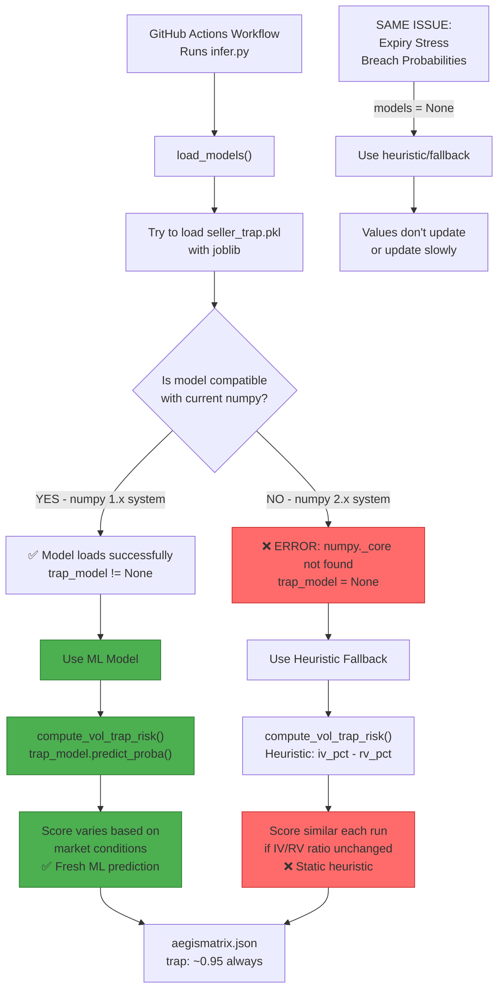

## Timeline: How This Happened

### 1️⃣ Models Trained (in Past)
```
Environment: numpy 1.x
Pickled models use: numpy 1.26.x API
Files saved: seller_trap.pkl, seller_regime.pkl, seller_breach.pkl
```

### 2️⃣ System Updated (Recently)
```
Upgraded to: numpy 2.x (breaking change)
numpy 2.x reorganized internal modules:
  - Old: numpy.core → New: numpy._core
  - Breaking pickle compatibility!
```

### 3️⃣ Inference Runs (Now)
```
GitHub Actions runs infer.py
Tries: joblib.load("seller_trap.pkl")
Error: joblib tries to import numpy.core module
       But numpy 2.x doesn't have that!
Result: ModelNotFoundError → model = None
Fallback: Uses heuristic calculation instead of ML
Output: Same static values because heuristic doesn't vary much
```

## Data Flow with Current numpy Issue

```
┌─────────────────────────────────────────────────────────┐
│  CURRENT STATE (numpy 2.x + old pickled models)        │
├─────────────────────────────────────────────────────────┤
│                                                         │
│  Fresh Market Data                                      │
│        ↓                                                │
│  Build Features                                         │
│        ↓                                                │
│  Try to load seller_trap.pkl                           │
│        ↓                                                │
│   ❌ FAIL (numpy._core not found)                       │
│        ↓                                                │
│  trap_model = None                                      │
│        ↓                                                │
│  compute_vol_trap_risk(features, trap_model=None)      │
│        ↓                                                │
│  if model is None: use heuristic                        │
│        ↓                                                │
│  trap_raw = iv_pct - rv_pct                            │
│  score = (trap_raw / 2) + 0.5 = 0.95                  │
│        ↓                                                │
│  Same score ~0.95 every run                             │
│  (if IV/RV percentiles don't change much)               │
│                                                         │
└─────────────────────────────────────────────────────────┘


┌─────────────────────────────────────────────────────────┐
│  AFTER FIX (Retrain with numpy 2.x)                    │
├─────────────────────────────────────────────────────────┤
│                                                         │
│  Fresh Market Data                                      │
│        ↓                                                │
│  Build Features                                         │
│        ↓                                                │
│  Load seller_trap.pkl (newly retrained)                │
│        ↓                                                │
│  ✅ SUCCESS (pickled with numpy 2.x API)               │
│        ↓                                                │
│  trap_model = <sklearn.ensemble.RandomForest>          │
│        ↓                                                │
│  compute_vol_trap_risk(features, trap_model)           │
│        ↓                                                │
│  if model is not None: use ML prediction               │
│        ↓                                                │
│  X = features.values → model.predict_proba(X)          │
│  score = model probability (varies per market state)   │
│        ↓                                                │
│  Different scores each run                              │
│  (ML model captures market dynamics)                     │
│                                                         │
└─────────────────────────────────────────────────────────┘
```

## Verification Commands

### Check numpy version
```bash
python -c "import numpy; print(f'numpy {numpy.__version__}')"
# If >= 2.0: numpy 2.x (causes model loading issues)
# If < 2.0: numpy 1.x (models load fine)
```

### Check if models load
```bash
cd aegismatrix-engine
python -c "
from seller.model import load_models
trap_m, regime_m, breach_m = load_models()
print(f'Trap model loaded: {trap_m is not None}')
print(f'Regime model loaded: {regime_m is not None}')
print(f'Breach model loaded: {breach_m is not None}')
"
```

### Expected output (CURRENT - BROKEN)
```
Error loading seller models: No module named 'numpy._core'
Trap model loaded: False
Regime model loaded: False
Breach model loaded: False
```

### Expected output (AFTER FIX - WORKING)
```
Trap model loaded: True
Regime model loaded: True
Breach model loaded: True
```

## Why This Matters for Your Dashboard

### Current Behavior (With Model Load Failure)
```
Run 1: volatility_trap = 0.95, expiry_stress = 0.15
Run 2: volatility_trap = 0.95, expiry_stress = 0.15  ← Same!
Run 3: volatility_trap = 0.95, expiry_stress = 0.15  ← Same!

User sees: "Nothing is changing! Are calculations happening?"
```

### After Fix (With Models Loading)
```
Run 1: volatility_trap = 0.94, expiry_stress = 0.18
Run 2: volatility_trap = 0.87, expiry_stress = 0.22  ← Different!
Run 3: volatility_trap = 0.92, expiry_stress = 0.16  ← Different!

User sees: "Values are updating! Calculations are working!"
```

## Recovery Path

**Step 1: Retrain (5 minutes)**
```bash
cd aegismatrix-engine
python train_all.py
```

**Step 2: Verify (30 seconds)**
```bash
python -c "from seller.model import load_models; t,r,b = load_models(); print('Fixed!' if t else 'Still broken')"
```

**Step 3: Test Inference (1 minute)**
```bash
python infer.py
cat ../aegismatrix.json  # Check that trap/stress now have real values
```

**Step 4: Push to GitHub (30 seconds)**
```bash
git add -A
git commit -m "Retrain models for numpy 2.x compatibility"
git push
```

**Result:** Next scheduled inference run will show dynamic values! ✅
