# Tradyxa Aegis Matrix

> **Advanced NIFTY 50 Options Analytics & Quantitative Forecasting System**
>
> *Zero-Cost Architecture • AI-Driven Insights • Real-Time Dashboard*


## 📖 Overview (A to Z)

**Tradyxa Aegis Matrix** is a sophisticated quantitative dashboard designed for NIFTY 50 options traders. It bridges the gap between institutional-grade analytics and retail accessibility by leveraging a **zero-cost infrastructure**.

The system operates on a "Store & Forward" architecture:
1.  **Data Acquisition:** Fetches market data (NIFTY, VIX) from Yahoo Finance and NSE.
2.  **AI Inference:** Runs three specialized ML engines (Direction, Seller, Buyer) to generate probabilistic forecasts.
3.  **Static Delivery:** Publishes a lightweight JSON payload to a React frontend hosted on Cloudflare Pages.

### Core Engines
*   **🛡️ AegisCore (Direction Engine):** Forecasts market direction across 6 time horizons (T+1 to T+40) using BiLSTM and XGBoost models. It answers: *"Where is the market heading?"*
*   **📉 RangeShield (Seller Engine):** Protects option sellers by calculating safe strike ranges, max pain zones, and volatility trap risks. It answers: *"Where is it safe to sell?"*
*   **⚡ PulseWave (Buyer Engine):** Identifies high-probability breakout setups, gamma windows, and spike direction bias for option buyers. It answers: *"When should I buy?"*

---

## 🛠️ Technology Stack

### Frontend (Client)
| Component | Version | Purpose |
|-----------|---------|---------|
| **React** | ^18.3.1 | UI Library |
| **TypeScript** | ^5.6.3 | Static Typing |
| **Vite** | ^5.4.20 | Build Tool & Dev Server |
| **Tailwind CSS** | ^3.4.17 | Utility-first Styling |
| **shadcn/ui** | Latest | Accessible UI Components |
| **Recharts** | ^2.15.0 | Data Visualization |
| **Wouter** | ^3.3.5 | Lightweight Routing |

### Backend (Engine)
| Component | Version | Purpose |
|-----------|---------|---------|
| **Python** | 3.12 | Core Logic Runtime |
| **Pandas** | >=2.0.0 | Data Manipulation |
| **Scikit-learn** | >=1.3.0 | ML Models (RandomForest, Logistic) |
| **XGBoost** | Latest | Gradient Boosting Models |
| **PyTorch** | Latest | LSTM/Deep Learning Models |
| **yfinance** | >=0.2.30 | Market Data Fetching |

### Infrastructure (Zero Cost)
| Component | Tier | Usage |
|-----------|------|-------|
| **GitHub Actions** | Free | CI/CD, Daily Inference, Weekly Training |
| **Cloudflare Pages** | Free | Static Frontend Hosting |
| **Yahoo Finance** | Free | Historical & Intraday Data |
| **NSE India** | Free | Real-time Spot Price (Fallback) |

---

## 🧠 Logic & Architecture

### System Architecture

```mermaid
graph TB
    subgraph "Data Sources"
        A[Yahoo Finance API] -->|OHLCV + VIX| B(Data Fetcher)
        A2[NSE India] -->|Real-time Spot| B
    end

    subgraph "AegisMatrix Engine (Python)"
        B --> C{Feature Engineering}
        C -->|Technical Indicators| D[Inference Pipeline]
        
        D --> E1[🛡️ AegisCore]
        D --> E2[📉 RangeShield]
        D --> E3[⚡ PulseWave]
        
        E1 -->|Direction| F[JSON Generator]
        E2 -->|Seller Signals| F
        E3 -->|Buyer Signals| F
    end

    subgraph "Delivery"
        F -->|aegismatrix.json| G[Git Repository]
        G -->|Trigger| H[Cloudflare Pages]
        H -->|Deploy| I[React Dashboard]
    end

    style E1 fill:#d97706,stroke:#fff
    style E2 fill:#059669,stroke:#fff
    style E3 fill:#7c3aed,stroke:#fff
```



### Data Pipeline Logic


---

## 🤖 Automation & Schedule

The system is fully automated using GitHub Actions workflows to ensure data freshness without manual intervention.

### 1. Daily Inference (`aegismatrix-infer-build.yml`)
*   **Schedule:** Monday to Friday
*   **Time:** 09:15 IST to 15:30 IST (Market Hours)
*   **Frequency:** Every 30 minutes
*   **Action:** Fetches latest data, runs inference, updates dashboard.

### 2. Weekly Training (`train_models.yml`)
*   **Schedule:** Every Saturday at 00:00 UTC
*   **Action:** Retrains all ML models on the latest week's data to adapt to changing market regimes.

---

## 📂 Project Structure

```
tradyxa-aegis/
├── .github/workflows/         # Automation workflows
│   ├── aegismatrix-infer-build.yml
│   └── train_models.yml
├── aegismatrix-engine/        # Python Backend
│   ├── buyer/                 # Buyer Engine Logic
│   ├── direction/             # Direction Engine Logic
│   ├── seller/                # Seller Engine Logic
│   ├── features/              # Feature Engineering
│   ├── models/                # Trained ML Models (.pkl, .pt)
│   ├── data_fetcher.py        # Data Acquisition
│   ├── infer.py               # Main Inference Script
│   └── train_all.py           # Training Orchestrator
├── client/                    # React Frontend
│   ├── src/
│   │   ├── components/tiles/  # Visualization Components
│   │   ├── pages/             # Dashboard Views
│   │   └── lib/               # Utilities & Types
│   └── public/data/           # Generated JSON Output
└── README.md                  # Documentation
```

---

## 🚀 Getting Started

### Prerequisites
*   Node.js 20+
*   Python 3.12+
*   Git

### Local Development

1.  **Clone the repository**
    ```bash
    git clone https://github.com/yourusername/tradyxa-aegis.git
    cd tradyxa-aegis
    ```

2.  **Install Frontend Dependencies**
    ```bash
    cd aegis-dashboard
    npm install
    ```

3.  **Run Frontend**
    ```bash
    npm run dev
    ```

4.  **Run Backend (Optional for Data Updates)**
    ```bash
    # In a separate terminal
    cd aegismatrix-engine
    pip install -r requirements.txt
    python infer.py
    ```

---

## ⚖️ Legal Disclaimer

**Educational Use Only.** Tradyxa Aegis Matrix is an educational tool demonstrating the application of machine learning in financial markets. It is **not** a SEBI-registered investment advisor.

*   **No Financial Advice:** The data and forecasts presented are for informational purposes only.
*   **Risk Warning:** Options trading involves significant risk and is not suitable for all investors.
*   **Data Latency:** Market data may be delayed.

---

*© 2025 Zeta Aztra Technologies. All Rights Reserved.*
