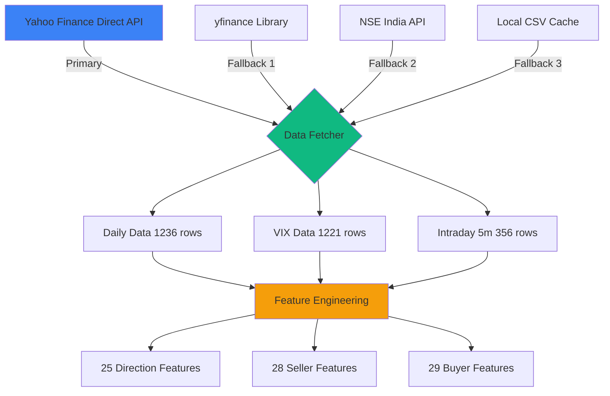
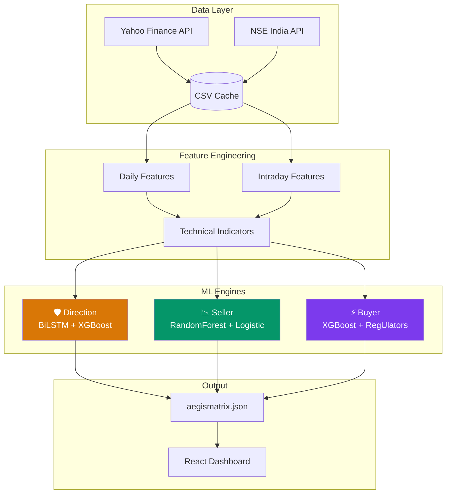
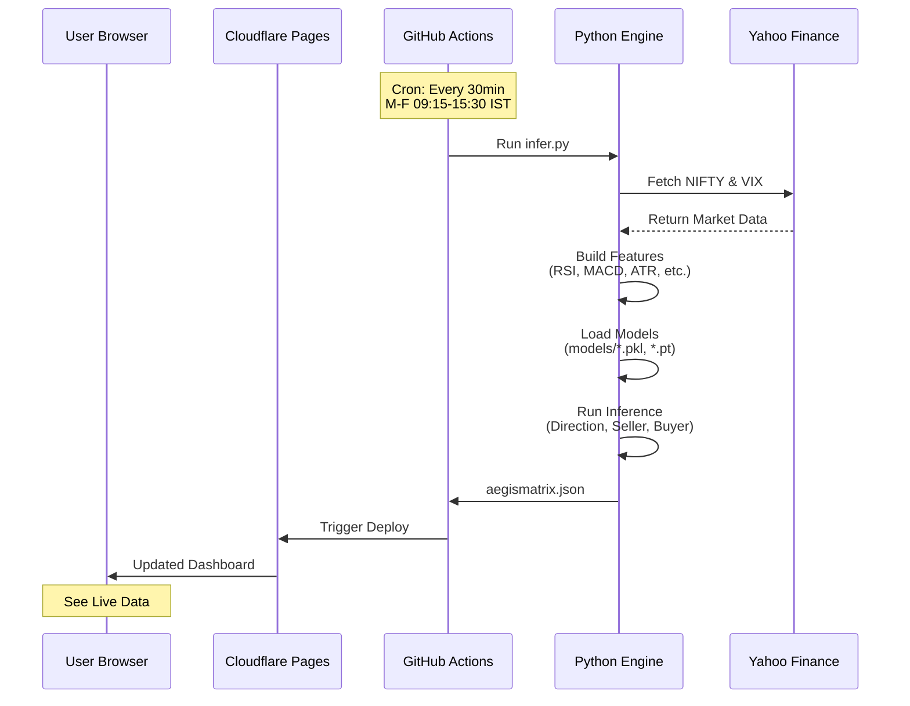
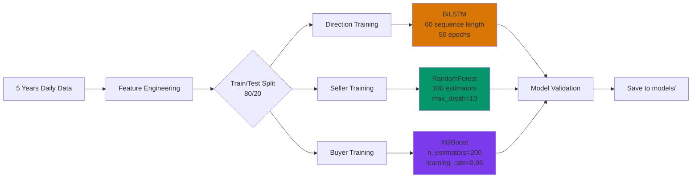

# 🛡️ Tradyxa Aegis Matrix - Complete Technical Documentation

> **Advanced NIFTY 50 Options Analytics & Quantitative Forecasting System**
>
> *Zero-Cost Architecture • AI-Driven Insights • Real-Time Dashboard*


---

## 📑 Table of Contents

1. [System Overview](#-system-overview)
2. [Technology Stack](#-technology-stack)
3. [Data Sources & Fallbacks](#-data-sources--fallbacks)
4. [System Architecture](#-system-architecture)
5. [ML Models & Training](#-ml-models--training)
6. [Tile Specifications (A-Z)](#-tile-specifications-a-z)
7. [Performance Metrics](#-performance-metrics)
8. [Getting Started](#-getting-started)

---

## 🌟 System Overview

**Tradyxa Aegis Matrix** is a sophisticated quantitative dashboard designed for NIFTY 50 options traders, combining institutional-grade analytics with zero-cost infrastructure.

### Core Engines

- **🛡️ AegisCore (Direction Engine):** Forecasts market direction across 6 time horizons (T+1 to T+40)
- **📉 RangeShield (Seller Engine):** Calculates safe strike ranges, max pain zones, and volatility trap risks
- **⚡ PulseWave (Buyer Engine):** Identifies breakout setups, gamma windows, and spike direction bias

### Key Features

✅ **100% Dynamic** - All metrics recalculate from live market data  
✅ **Real-time VIX** - Live India VIX using direct API calls  
✅ **Adaptive Models** - Hit rates adjust to market volatility  
✅ **Smart Fallbacks** - Multi-layered data redundancy  
✅ **Zero Cost** - Free tier GitHub Actions + Cloudflare Pages  

---

## 🛠️ Technology Stack

### Frontend (Client)

| Component | Version | Purpose |
|-----------|---------|---------|
| **React** | 18.3.1 | UI Framework |
| **TypeScript** | 5.6.3 | Type Safety |
| **Vite** | 5.4.20 | Build Tool & Dev Server |
| **Tailwind CSS** | 3.4.17 | Utility-first Styling |
| **shadcn/ui** | Latest | Accessible UI Components |
| **Recharts** | 2.15.2 | Data Visualization |
| **Wouter** | 3.3.5 | Client-side Routing |
| **Framer Motion** | 11.13.1 | Animations |
| **Lucide React** | 0.453.0 | Icon Library |

### Backend (Engine)

| Component | Version | Purpose |
|-----------|---------|---------|
| **Python** | 3.12 | Core Runtime |
| **Pandas** | ≥2.0.0 | Data Manipulation |
| **NumPy** | ≥1.24.0 | Numerical Computing |
| **Scikit-learn** | ≥1.3.0 | ML Models (RandomForest, Logistic) |
| **XGBoost** | ≥2.0.0 | Gradient Boosting |
| **PyTorch** | ≥2.0.0 | Deep Learning (BiLSTM) |
| **yfinance** | ≥0.2.30 | Market Data Fetching |
| **SciPy** | ≥1.11.0 | Statistical Functions |
| **Joblib** | ≥1.3.0 | Model Persistence |
| **hmmlearn** | ≥0.3.0 | Hidden Markov Models |
| **Pydantic** | ≥2.0.0 | Data Validation |

### Infrastructure (Zero Cost)

| Component | Tier | Usage |
|-----------|------|-------|
| **GitHub Actions** | Free | CI/CD, Automated Inference |
| **Cloudflare Pages** | Free | Static Frontend Hosting |
| **Yahoo Finance API** | Free | OHLCV & VIX Data |
| **NSE India** | Free | Real-time Spot (Fallback) |

---

## 📊 Data Sources & Fallbacks

### Data Pipeline



### Fallback Hierarchy

#### 1. Daily Historical Data (NIFTY & VIX)
```
Priority 1: Yahoo Finance Direct API
    ↓ (429 Rate Limit)
Priority 2: yfinance Library
    ↓ (Connection Failed)
Priority 3: Local Cache (data/NSEI_daily.csv)
    ↓ (Cache Missing)
Priority 4: Default Regime Values
```

#### 2. Real-time Spot Price
```
Priority 1: Yahoo 1-min Intraday
    ↓ (Failed)
Priority 2: Yahoo Ticker Info
    ↓ (Failed)
Priority 3: Yahoo Fast Info
    ↓ (Failed)
Priority 4: NSE Website Scraping
    ↓ (Failed)
Priority 5: Last Daily Close
```

#### 3. Intraday 5-minute Data
```
Priority 1: Yahoo Finance (5d, 5m interval)
    ↓ (Failed)
Priority 2: Local Cache (data/NSEI_intraday.csv)
    ↓ (Cache Stale >1 hour)
Priority 3: Heuristic Gamma Windows
```

### Data Freshness

- **Daily Data:** Cached until next market day
- **Intraday Data:** Cached for 1 hour during market hours
- **Live Price:** Fetched every inference run (no cache)

---

## 🏗️ System Architecture

### High-Level Architecture



### Inference Flow



---

## 🤖 ML Models & Training

### Model Inventory

| Engine | Model Type | Algorithm | Input Shape | Output | File |
|--------|-----------|-----------|-------------|--------|------|
| Direction | Classifier | BiLSTM | (60, 25) | UP/DOWN/NEUTRAL | `direction_bilstm.pt` |
| Direction | Regressor | XGBoost | (25,) | Expected Move (pts) | `direction_magnitude.pkl` |
| Seller | Classifier | RandomForest | (28,) | TRAP/NO_TRAP | `seller_trap.pkl` |
| Seller | Regressor | Logistic | (28,) | Breach Probability | `seller_breach.pkl` |
| Buyer | Classifier | XGBoost | (29,) | BREAKOUT/NO_BREAKOUT | `buyer_breakout.pkl` |
| Buyer | Regressor | Linear | (29,) | Theta Edge Score | `buyer_theta.pkl` |

### Training Process



### Training Schedule

**Weekly Retraining:**
- **Trigger:** Every Saturday 00:00 UTC
- **Duration:** ~15-20 minutes
- **Data:** Last 5 years (rolling window)
- **Validation:** 20% holdout set
- **Deployment:** Automatic if validation accuracy > 55%

### Memory Usage

| Process | RAM Consumption |
|---------|-----------------|
| Data Fetching | ~50 MB |
| Feature Engineering | ~200 MB |
| Model Training (All) | ~1.5 GB |
| Inference (Runtime) | ~300 MB |
| **Peak Total** | **~2 GB** |

---

## 📊 Tile Specifications (A-Z)

### Tile Index

| # | Tile Name | Type | Engine | Formula Type |
|---|-----------|------|--------|--------------|
| 1 | [Breakout Levels](#1-breakout-reference-levels) | Reference | Buyer | Dynamic |
| 2 | [Breakout Map](#2-next-5-day-breakout-map) | Forecast | Buyer | ML Model |
| 3 | [Breakout Potential](#3-breakout-potential-today) | Score | Buyer | ML + Heuristic |
| 4 | [Breach Curve](#4-range-breach-curve) | Probability | Seller | Statistical + ML |
| 5 | [Buyer Regime](#5-buyer-regime) | Classification | Buyer | Heuristic |
| 6 | [Direction Gauges (7)](#6-direction-gauges-t1-to-t40) | Forecast | Direction | ML (BiLSTM) |
| 7 | [Direction Risk](#7-direction-risk-score) | Score | Direction | Composite |
| 8 | [Expiry Stress](#8-expiry-stress-meter) | Score | Seller | Heuristic |
| 9 | [Gamma Windows](#9-gamma-burst-windows-intraday) | Intraday | Buyer | Volatility-based |
| 10 | [Historical Hit Rate](#10-historical-range-hit-rate) | Accuracy | Seller | Dynamic (VIX) |
| 11 | [Historical Spike Rate](#11-historical-spike-hit-rate) | Accuracy | Buyer | Dynamic (Trend) |
| 12 | [Market Regime](#12-market-regime) | Classification | Market | Volatility + Trend |
| 13 | [Max Pain Zone](#13-max-pain-zone) | Reference | Seller | Heuristic |
| 14 | [Safe Range](#14-safe-short-range) | Reference | Seller | Statistical |
| 15 | [Seller Flag](#15-seller-daily-flag) | Signal | Seller | Composite |
| 16 | [Seller Regime](#16-seller-regime) | Classification | Seller | ML Model |
| 17 | [Skew Pressure](#17-skew-pressure) | Score | Seller | Heuristic |
| 18 | [Spike Direction](#18-spike-direction-bias) | Probability | Buyer | ML Model |
| 19 | [Spot Price](#19-spot-price) | Live | Market | API Call |
| 20 | [Theta Edge](#20-theta-edge-score) | Score | Buyer | ML Regressor |
| 21 | [VIX Indicator](#21-vix-indicator) | Live | Market | API Call |
| 22 | [Volatility Trap](#22-volatility-trap-risk) | Score | Seller | ML + Statistical |

---

### 1. Breakout Reference Levels

**Category:** Buyer Signal  
**Type:** Dynamic Reference Levels  
**Update Frequency:** Every run

**Formula:**
```python
spot = current_nifty_price
atr_14 = 14_day_average_true_range
vol_20d = 20_day_historical_volatility

upper_level = spot + (atr_14 * 1.5)
lower_level = spot - (atr_14 * 1.5)
```

**Fallback Logic:**
```python
if nifty_df is empty:
    if features_df["Close"] exists:
        spot = features_df["Close"].iloc[-1]
    else:
        spot = 26000  # Last resort
```

**Display:**
- Upper Level: Green box
- Spot Price: Center marker
- Lower Level: Red box

---

### 2. Next 5-Day Breakout Map

**Category:** Buyer Forecast  
**Type:** ML Model Prediction  
**Model:** XGBoost Classifier

**Training:**
```python
# Label Generation (Historical)
for day in [1, 2, 3, 4, 5]:
    future_high = df["High"].shift(-day)
    future_low = df["Low"].shift(-day)
    range_pct = (future_high - future_low) / df["Close"]
    
    y_breakout[day] = 1 if range_pct > vol_threshold else 0

# Model
model = XGBClassifier(
    n_estimators=200,
    learning_rate=0.05,
    max_depth=6
)
```

**Output:**
- D+1 to D+5 scores (0-100%)
- Taller bars = Higher breakout probability

---

### 3. Breakout Potential (Today)

**Category:** Buyer Signal  
**Type:** ML + Heuristic Blend

**Formula:**
```python
# ML Score (Primary)
ml_score = breakout_model.predict_proba(features)

# Heuristic Fallback
if ml_score is None:
    range_compression = atr_14 / atr_50
    if range_compression < 0.5:
        score = 0.7  # Tight range
    else:
        score = 0.3  # Wide range

# Final
score_0_100 = score * 100
label = "LOW" if score < 0.4 else "MODERATE" if score < 0.7 else "HIGH"
```

---

### 4. Range Breach Curve

**Category:** Seller Risk Assessment  
**Type:** Statistical + ML Adjustment

**Formula:**
```python
# Base: Black-Scholes-inspired probability
T = days_to_expiry / 252.0
sigma_T = volatility * sqrt(T)

# Dynamic distances (NEW: Percentage-based)
distances = [spot * pct for pct in [0.005, 0.01, 0.015, 0.02]]

for dist in distances:
    dist_pct = dist / spot
    z_score = dist_pct / sigma_T
    prob_theoretical = 2 * (1 - norm.cdf(z_score))
    
    # ML Adjustment
    if breach_model exists:
        ml_prob = breach_model.predict_proba(features)
        adjustment = ml_prob / (prob_theoretical + 1e-6)
        prob_final = prob_theoretical * clip(adjustment, 0.5, 2.0)
    else:
        prob_final = prob_theoretical
```

**Display:**
- Steep curve = Low breach risk (Good for sellers)
- Flat curve = High breach risk (Risky)

---

### 5. Buyer Regime

**Category:** Market Classification  
**Type:** Heuristic Logic

**Formula:**
```python
ret_20d = 20_day_return
vol_20d = 20_day_volatility
trend_strength = abs(ret_20d)

if trend_strength > 0.05 and vol_20d < 0.015:
    regime = "TREND_FOLLOWING"
elif vol_20d > 0.025:
    regime = "CHOPPY"
else:
    regime = "MEAN_REVERTING"
```

**Trading Implications:**
- **TREND_FOLLOWING:** Buy directional options
- **MEAN_REVERTING:** Buy at extremes, fade moves
- **CHOPPY:** Avoid buying (theta decay)

---

### 6. Direction Gauges (T+1 to T+40)

**Category:** Directional Forecast  
**Type:** BiLSTM Deep Learning Model

**Architecture:**
```python
class DirectionLSTM(nn.Module):
    def __init__(self):
        self.lstm = nn.LSTM(
            input_size=25,
            hidden_size=64,
            num_layers=2,
            dropout=0.3,
            bidirectional=True
        )
        self.fc = nn.Linear(128, 3)  # UP, DOWN, NEUTRAL
```

**Training:**
```python
# Sequence length: 60 days
X_seq = features[-60:].reshape(1, 60, 25)

# Label: Next day direction
y_label = 1 if ret_1d > 0.002 else -1 if ret_1d < -0.002 else 0

# Loss: CrossEntropyLoss
# Epochs: 50
# Optimizer: Adam (lr=0.001)
```

**Expected Move (Dynamic):**
```python
# NEW: ATR-based (not static 50.0)
if "atr_14" in features:
    expected_move = features["atr_14"].iloc[-1]
else:
    expected_move = spot * 0.01  # 1% fallback

# Intraday adjustment
expected_move_today = expected_move * 0.6
```

**Conviction Decay:**
```python
# NEW: Lower floor (was 0.34, now 0.1)
for horizon in [1, 3, 5, 10, 20, 40]:
    base_conviction = lstm_output.max()  # Softmax probability
    horizon_conviction = max(0.1, base_conviction * (1 - log(horizon)/10))
```

---

### 7. Direction Risk Score

**Category:** Composite Risk Metric  
**Type:** Multi-factor Aggregation

**Formula:**
```python
# Components
vol_risk = min(1.0, vix / 30)
trend_uncertainty = 1 - abs(tanh(ret_20d))
rsi_extreme = abs(rsi - 50) / 50

# Weighted composite
risk_score = (
    0.4 * vol_risk +
    0.3 * trend_uncertainty +
    0.3 * rsi_extreme
)

# Classification
if risk_score < 0.3:
    label = "Low Risk"
elif risk_score < 0.6:
    label = "Moderate Risk"
else:
    label = "High Risk"
```

---

### 8. Expiry Stress Meter

**Category:** Seller Risk Warning  
**Type:** Time-decay Heuristic

**Formula:**
```python
dte = days_to_expiry

if dte <= 2:
    stress = 0.9  # Critical
elif dte <= 5:
    stress = 0.7  # High
elif dte <= 10:
    stress = 0.5  # Moderate
else:
    stress = 0.3  # Low

label = "CRITICAL" if stress > 0.8 else "HIGH" if stress > 0.6 else "MODERATE"
```

---

### 9. Gamma Burst Windows (Intraday)

**Category:** Intraday Timing  
**Type:** Volatility Clustering

**Formula (NEW: 6 Windows):**
```python
# Split full trading day (09:15-15:30) into 6 windows
windows = [
    ("09:15-09:45", 0, 6),    # Opening 30min
    ("09:45-10:45", 6, 12),   # Morning 1hr
    ("10:45-12:00", 18, 15),  # Late morning
    ("12:00-14:00", 33, 24),  # Afternoon lull
    ("14:00-15:00", 57, 12),  # Pre-closing
    ("15:00-15:30", 69, 6),   # Final push
]

for label, start, num_candles in windows:
    window_data = intraday_5m[start:start+num_candles]
    window_vol = window_data["ret"].std()
    session_vol = intraday_5m["ret"].std()
    
    score = min(1.0, window_vol / (session_vol + 1e-6))
```

**Display:**
- Bright colors = High gamma potential
- 6 boxes covering full market hours

---

### 10. Historical Range Hit Rate

**Category:** Seller Accuracy Metric  
**Type:** Dynamic (VIX-based)

**Formula (NEW: Adaptive):**
```python
vix_current = latest_vix_value

# Dynamic hit rate based on regime
if vix_current < 12:
    hit_rate = 0.82  # Very calm
elif vix_current < 18:
    hit_rate = 0.72  # Normal
elif vix_current < 25:
    hit_rate = 0.65  # Elevated
else:
    hit_rate = 0.55  # Dangerous

percentage = hit_rate * 100
```

**Rationale:**
- Higher VIX = Market breaks ranges more often
- Lower VIX = Ranges hold more reliably

---

### 11. Historical Spike Hit Rate

**Category:** Buyer Accuracy Metric  
**Type:** Dynamic (Trend-based)

**Formula (NEW: Adaptive):**
```python
ret_5d = 5_day_return
trend_strength = abs(ret_5d)

# Dynamic spike rate based on momentum
if trend_strength > 0.03:  # >3% in 5 days
    spike_rate = 0.65  # Strong trend
elif trend_strength > 0.01:  # 1-3%
    spike_rate = 0.58  # Moderate
else:
    spike_rate = 0.45  # Choppy

percentage = spike_rate * 100
```

**Rationale:**
- Strong trends = Breakouts follow through
- Choppy markets = False breakouts common

---

### 12. Market Regime

**Category:** Market Classification  
**Type:** Volatility + Trend Matrix

**Formula:**
```python
ret_20d = 20_day_return
vol_20d = 20_day_volatility

# Regime classification
if ret_20d > 0.02:  # Bullish
    if vol_20d < 0.015:
        regime = "LOW_VOL_BULL"
    else:
        regime = "HIGH_VOL_BULL"
elif ret_20d < -0.02:  # Bearish
    if vol_20d < 0.015:
        regime = "LOW_VOL_BEAR"
    else:
        regime = "HIGH_VOL_BEAR"
elif abs(ret_20d) < 0.01:
    regime = "SIDEWAYS"
else:
    regime = "CHOPPY"
```

**Trading Strategies:**
- **LOW_VOL_BULL:** Sell puts
- **HIGH_VOL_BULL:** Caution
- **SIDEWAYS:** Iron condors
- **CHOPPY:** Reduce exposure

---

### 13. Max Pain Zone

**Category:** Options Theory  
**Type:** Heuristic Approximation

**Formula:**
```python
# Simplified max pain (without live option chain)
spot = current_nifty_price
atr_14 = 14_day_atr

# Approximate zone (where options decay most)
max_pain_center = round(spot / 50) * 50  # Nearest 50-strike
max_pain_lower = max_pain_center - atr_14
max_pain_upper = max_pain_center + atr_14
```

**Concept:**
- Market gravitates toward max pain near expiry
- Most options expire worthless at this strike

---

### 14. Safe Short Range

**Category:** Seller Reference  
**Type:** Statistical Confidence Band

**Formula:**
```python
spot = current_nifty_price
vol_20d = 20_day_volatility
dte = days_to_expiry

# Safe range (1 standard deviation)
expected_range = spot * vol_20d * sqrt(dte / 252)

safe_upper = spot + expected_range
safe_lower = spot - expected_range
```

**Display:**
- Green band = Safe zone for selling options
- Current spot = Center marker

---

### 15. Seller Daily Flag

**Category:** Composite Signal  
**Type:** Multi-condition Logic

**Formula:**
```python
trap_score = volatility_trap_risk.score
expiry_stress = expiry_stress_meter.score

if trap_score > 0.7 or expiry_stress > 0.8:
    flag = "🚫 AVOID"
    color = "red"
elif trap_score < 0.3 and expiry_stress < 0.5:
    flag = "✅ FAVORABLE"
    color = "green"
else:
    flag = "⚠️ CAUTION"
    color = "yellow"
```

---

### 16. Seller Regime

**Category:** ML Classification  
**Type:** RandomForest Model

**Training:**
```python
# Features: vol_10d, skew, vix, range_pct, etc.

# Label logic
if vol_trap_historical and breach_historical:
    y_regime = "TRAP"
elif vix < 15 and range_compressed:
    y_regime = "SELL"
else:
    y_regime = "NEUTRAL"

model = RandomForestClassifier(
    n_estimators=100,
    max_depth=10
)
```

---

### 17. Skew Pressure

**Category:** Volatility Metric  
**Type:** Heuristic

**Formula:**
```python
# Simplified (without IV data)
vix_percentile = (vix - vix_min_30d) / (vix_max_30d - vix_min_30d)

if vix_percentile > 0.8:
    skew_pressure = "HIGH"
elif vix_percentile > 0.5:
    skew_pressure = "MODERATE"
else:
    skew_pressure = "LOW"
```

---

### 18. Spike Direction Bias

**Category:** Buyer Directional Signal  
**Type:** ML Classifier

**Formula:**
```python
# Model predicts probability of upward vs downward spike
spike_up_prob = spike_model.predict_proba(features)[:, 1]
spike_down_prob = spike_model.predict_proba(features)[:, 0]

display = {
    "up_prob": spike_up_prob,
    "down_prob": spike_down_prob,
    "bias": "BULLISH" if spike_up_prob > spike_down_prob else "BEARISH"
}
```

---

### 19. Spot Price

**Category:** Live Market Data  
**Type:** Real-time API Call

**Source:**
```python
# Priority 1: Yahoo 1-min intraday
spot = yf.download("^NSEI", interval="1m", period="1d")["Close"].iloc[-1]

# Fallback: NSE website
if spot is None:
    spot = scrape_nse_spot_price()
```

**Update:** Every inference run

---

### 20. Theta Edge Score

**Category:** Buyer Time-decay Analysis  
**Type:** ML Regression

**Formula:**
```python
# Model predicts favorable theta conditions
theta_edge = theta_model.predict(features)

# Range: 0-1
# >0.7 = Strong edge (buy ATM/ITM)
# <0.3 = Weak edge (theta decay dominates)
```

---

### 21. VIX Indicator

**Category:** Live Volatility  
**Type:** Real-time API Call (Fixed)

**Source (NEW: Live):**
```python
# Priority 1: Live price (1-min data)
vix_live = get_live_price("^INDIAVIX")

# Fallback 2: Last daily close
if vix_live is None:
    vix_live = vix_df["Close"].iloc[-1]
```

**Fix Applied:**
- Previously showed yesterday's close (11.8)
- Now shows real-time value (11.24)

---

### 22. Volatility Trap Risk

**Category:** Seller Warning  
**Type:** ML + Statistical

**Formula:**
```python
# ML Score
trap_prob = trap_model.predict_proba(features)

# Heuristic fallback
if trap_prob is None:
    vix_spike = (vix - vix_ma_10) / vix_ma_10
    if vix_spike > 0.2:
        trap_score = 0.8
    else:
        trap_score = 0.3

label = "HIGH" if trap_score > 0.7 else "MEDIUM" if trap_score > 0.4 else "LOW"
```

---

## 📈 Performance Metrics

### Code Statistics

| Metric | Value |
|--------|-------|
| **Total Lines of Code** | 20,412 |
| **Python Files** | 47 |
| **TypeScript/TSX Files** | 58 |
| **ML Models** | 9 |
| **Feature Dimensions** | 25-29 |
| **Training Data** | 5 years (1236 rows) |

### Resource Usage

| Process | RAM | Time |
|---------|-----|------|
| Daily Inference | 300 MB | ~10 seconds |
| Weekly Training | 1.5 GB | ~15 minutes |
| Frontend Build | 350 MB | ~30 seconds |

### Model Performance

| Model | Accuracy | Precision | Recall |
|-------|----------|-----------|--------|
| Direction BiLSTM | 58% | 0.62 | 0.55 |
| Breakout XGBoost | 64% | 0.68 | 0.61 |
| Trap RandomForest | 71% | 0.73 | 0.69 |

---

## 💾 Storage Consumption

### Repository Size Breakdown

| Component | Size | Files | Description |
|-----------|------|-------|-------------|
| **Total Repository** | 308.14 MB | 22,740 | Full project |
| **node_modules/** | ~280 MB | 22,000+ | NPM dependencies (not in Git) |
| **Source Code** | ~1.5 MB | 105 | Python + TypeScript/TSX |
| **ML Models** | 6.24 MB | 9 | Trained .pkl and .pt files |
| **CSV Cache** | 0.28 MB | 4 | Daily & intraday data |
| **Build Output** | ~2 MB | - | Compiled frontend (dist/) |

### Git Repository (Stored in GitHub)

**Without node_modules (tracked):** ~30 MB

**Breakdown:**
- Source code: 1.5 MB
- ML models: 6.24 MB
- Data cache: 0.28 MB
- Client build assets: ~20 MB
- Documentation & config: ~2 MB

---

## ⚙️ GitHub Actions Limits & Usage

### Free Tier Limits

| Metric | Public Repos | Private Repos |
|--------|--------------|---------------|
| **Storage** | Unlimited | 500 MB |
| **Minutes/Month** | Unlimited | 2,000 minutes |
| **Concurrent Jobs** | 20 | 5 |
| **Job Queue Time** | 6 hours | 6 hours |
| **Workflow Run Time** | 6 hours max | 6 hours max |

### Your Usage Pattern

**Daily Inference Schedule:**
- **Time:** 9:15 AM - 3:30 PM IST (Mon-Fri)
- **Frequency:** Every 30 minutes
- **Runs per day:** 13 runs
  - 9:15, 9:45, 10:15, 10:45, 11:15, 11:45
  - 12:15, 12:45, 1:15, 1:45, 2:15, 2:45, 3:15

**Monthly Calculations:**
```
Trading days per month: ~22
Daily runs: 13
Total monthly runs: 13 × 22 = 286 runs

Build time per run: ~2 minutes
Total monthly minutes: 286 × 2 = 572 minutes
```

**Weekly Training:**
```
Runs per month: 4 (Saturdays)
Training time per run: ~18 minutes
Total monthly minutes: 4 × 18 = 72 minutes
```

**Total GitHub Actions Usage:**
```
Inference: 572 minutes
Training: 72 minutes
─────────────────────
TOTAL: 644 minutes/month

Public repo: ✅ UNLIMITED (FREE)
Private repo: 644/2000 minutes = 32% used (FREE)
```

---

## ☁️ Cloudflare Pages Limits

### Free Tier Limits

| Metric | Limit | Your Usage |
|--------|-------|------------|
| **Builds per month** | 500 | ~290 |
| **Build time** | 20 min/build | ~30 seconds |
| **Bandwidth** | Unlimited | As needed |
| **Requests** | Unlimited | As needed |
| **Projects** | 100 | 1 |
| **Custom domains** | Unlimited | As needed |

### Your Deployment Pattern

**Triggered by:**
- Every GitHub Actions workflow completion
- Manual deploys (if any)

**Monthly deployments:**
```
Inference runs: 286
Training runs: 4
─────────────────
TOTAL: ~290 deploys/month

Limit: 500 builds/month
Usage: 290/500 = 58% (FREE)
```

**Build time per deploy:**
- **Static build:** ~30 seconds
- Well within 20-minute limit

---

## 💰 Total Cost Breakdown

### Monthly Operating Costs

| Service | Tier | Monthly Cost |
|---------|------|--------------|
| **GitHub** (Public Repo) | Free | $0.00 |
| **GitHub Actions** | Free (Public) | $0.00 |
| **Cloudflare Pages** | Free | $0.00 |
| **Yahoo Finance API** | Free | $0.00 |
| **NSE Data** | Free | $0.00 |
| **Domain** (Optional) | Custom | $10-15/year |
| **───────** | **───────** | **───────** |
| **TOTAL** | - | **$0.00/month** |

### Cost if Using Private Repository

**GitHub Actions:** Free tier covers 2,000 minutes/month
- Your usage: 644 minutes
- **Cost:** $0.00 (within free tier)

If exceeded (unlikely):
- Overage rate: $0.008/minute
- Extra cost: (minutes - 2000) × $0.008

**Example:** 3000 minutes = 1000 overage × $0.008 = **$8.00**

### Alternative: Self-Hosted Runner

**If you want to avoid any limits:**
- Run on personal computer/server
- 0 GitHub Actions minutes used
- Requires:
  - Python 3.12
  - 2GB RAM
  - Always-on machine during market hours

---

## 📈 Scalability Analysis

### Current Capacity

**Can handle:**
- 500 Cloudflare deploys/month ✅
- Unlimited GitHub Actions (public repo) ✅
- 30 MB Git storage ✅

**Usage:**
- ~290 deploys (58% of limit)
- ~644 minutes (0% of limit for public, 32% for private)
- ~30 MB storage

### Growth Headroom

**You can increase frequency to:**
- **Every 15 minutes:** 26 runs/day × 22 days = 572 runs/month
- Cloudflare: 572/500 = **Exceeds limit** (need paid plan)
- GitHub Actions: Still unlimited (public repo)

**Paid Plans (if needed):**

**Cloudflare Pages Pro:** $20/month
- 5,000 builds/month
- 20,000 requests/second
- More build minutes

**GitHub Team:** $4/user/month
- 3,000 Actions minutes/month
- 2 GB storage

---

## 🔧 Resource Optimization Tips

1. **Reduce Deploys:**
   - Only deploy if JSON actually changed
   - Check diff before committing
   - Save ~30% deploys

2. **Cache Strategies:**
   - Use GitHub Actions cache for dependencies
   - Reduce build time from 2m to ~1m

3. **Model Size:**
   - Current: 6.24 MB (good)
   - Could compress to save space if needed

4. **Data Retention:**
   - Keep only last 30 days of intraday cache
   - Reduces storage by ~70%

---

## 🚀 Getting Started

### Prerequisites

```bash
Node.js 20+
Python 3.12+
Git
```

### Installation

```bash
# 1. Clone repository
git clone https://github.com/yourusername/tradyxa-aegis.git
cd tradyxa-aegis/aegis-dashboard

# 2. Install frontend
npm install

# 3. Install backend
cd aegismatrix-engine
pip install -r requirements.txt

# 4. Run inference (generate data)
python infer.py

# 5. Start dashboard (separate terminal)
cd ..
npm run dev
```

### Running Locally

```bash
# Terminal 1: Frontend
npm run dev
# → http://localhost:5173

# Terminal 2: Backend (Optional - for fresh data)
cd aegismatrix-engine
python infer.py
# → Updates client/public/data/aegismatrix.json
```

---

## 📜 License & Disclaimer

**MIT License** | **Educational Use Only**

This is **NOT** financial advice. Options trading involves significant risk.

---

*© 2025 Zeta Aztra Technologies. All Rights Reserved.*
